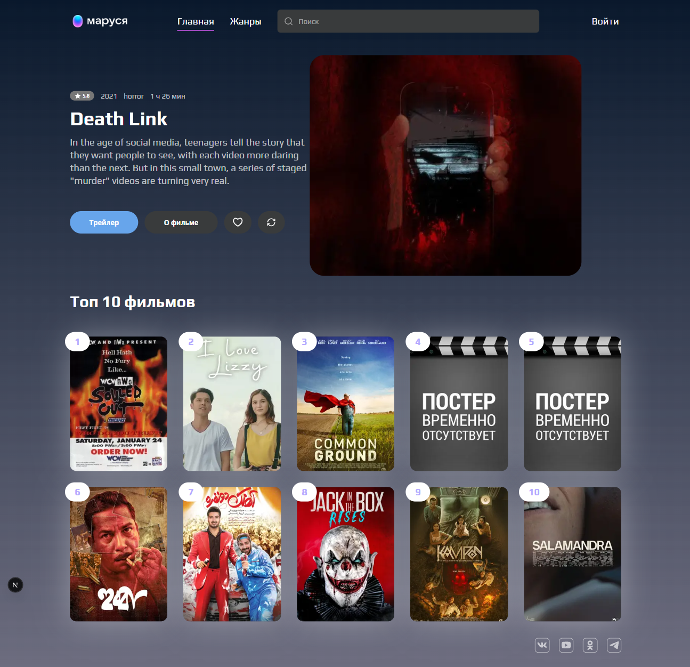
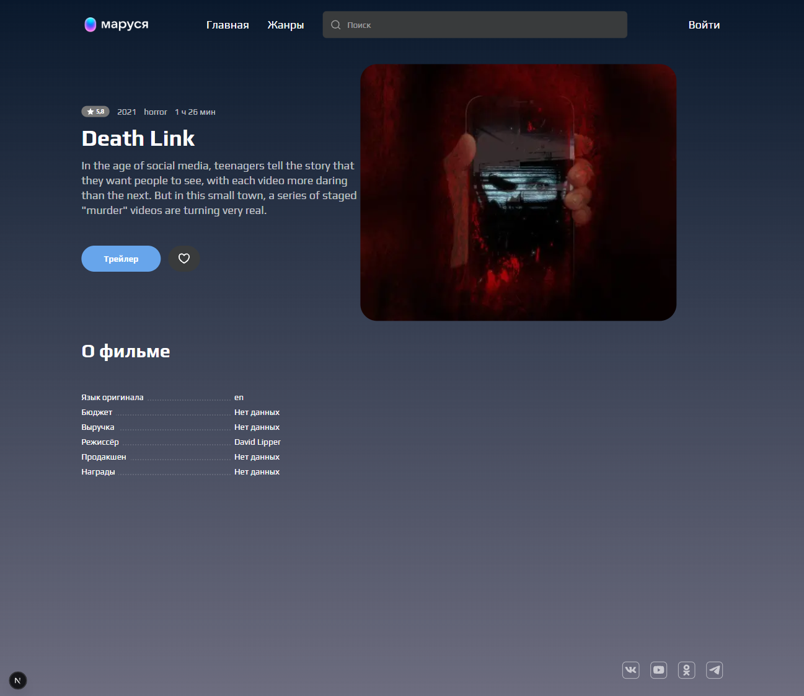
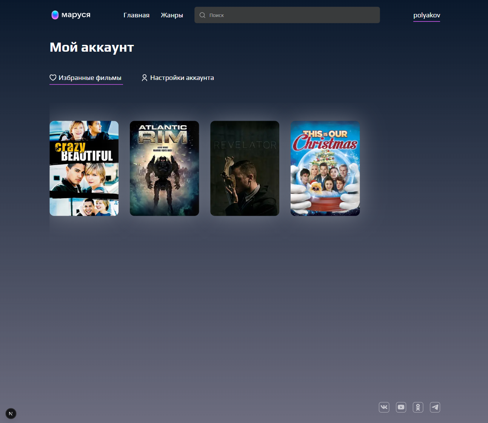
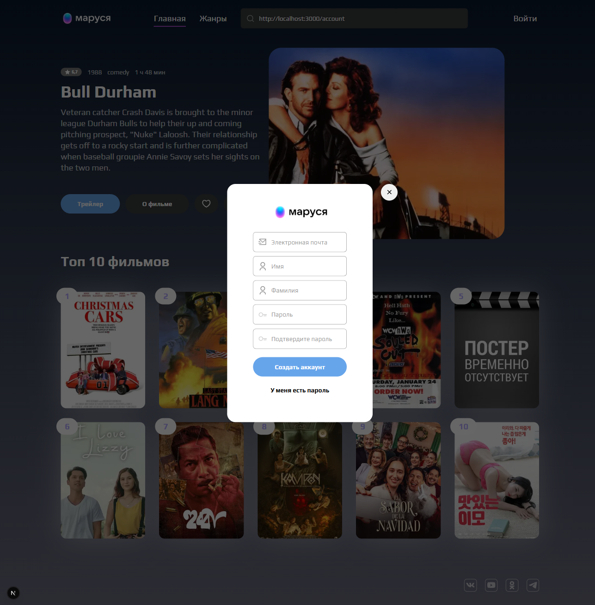

# VK Marusya

A responsive web application for discovering movies, viewing detailed information and trailers, and managing a personal list of favorite movies.

The project was developed as a final project for the Skillbox React course.

## Features

- User registration and authentication
- Persistent user session using cookies
- Logout
- Movie search with debounce
- Movie details
- Movie trailers
- Popular movies
- Movies by genre
- Dynamic genre pages
- Load more functionality
- Add movies to favorites
- Remove movies from favorites
- Favorites page
- User account page
- Responsive layout for desktop, tablet, and mobile devices

## Screenshots

### Home Page



### Movie Details



### Favorites



### Authentication



## Tech Stack

- Next.js
- React
- TypeScript
- SCSS
- React Hook Form
- REST API
- Fetch API
- App Router

## Project Structure

```text
src/
├── api/           # API requests
├── app/           # Pages and routing
├── components/    # Reusable UI components
├── context/       # Global application state
├── styles/        # Global styles, variables and mixins
└── types/         # TypeScript types
```

### Prerequisites

Make sure you have the following installed:

- Node.js 18.18 or later
- npm

### Installation

Clone the repository:

```bash
git clone https://github.com/lThe-onlyl/vk-marusya.git
```
